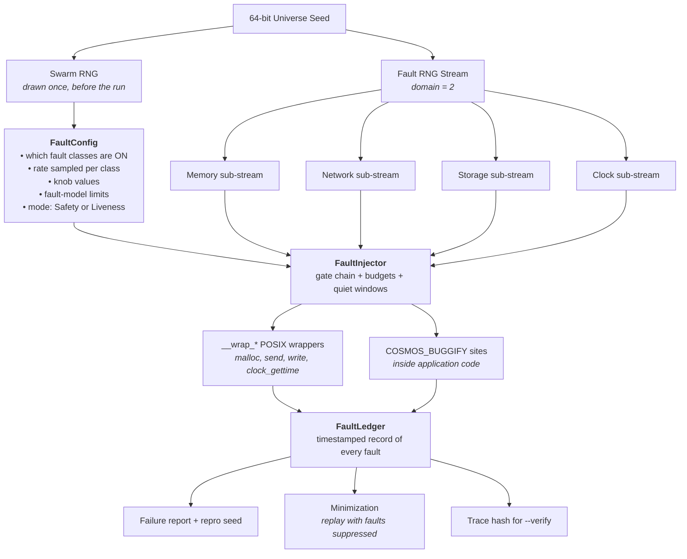
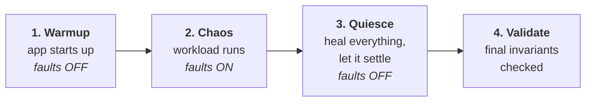
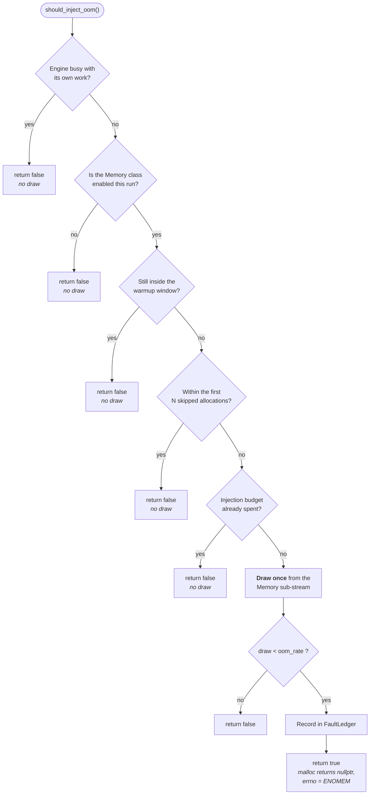

# Cosmos: Fault Injection Design

This document defines how `libcosmos` breaks things on purpose.

Fault injection is the part of the simulator that makes rare, unlucky situations happen often: memory running out, packets vanishing, disks corrupting, servers dying at the worst possible moment. Its job is **not** to decide whether the application is correct — that is the assertion layer's job (`always` / `sometimes`, see `docs/design.md` §12). Its job is to steer execution into the error paths that normal testing never reaches.

> **Core rule:** a fault is an **input**, not a failure. `malloc` returning `nullptr` is not a bug — it is a normal thing that happens on real machines. The bug is whatever the application does next.

Research background: **`docs/antithesis-study-notes.md`**. Full API reference: **`docs/design.md`**. Architecture & seams: **`docs/architecture.md`**.

---

## Table of Contents

1. [Concepts](#1-concepts)
2. [The Fault Model (What the System Promises to Survive)](#2-the-fault-model-what-the-system-promises-to-survive)
3. [Safety Mode vs Liveness Mode](#3-safety-mode-vs-liveness-mode)
4. [The Three Shapes of a Fault](#4-the-three-shapes-of-a-fault)
5. [Block-Level Architecture](#5-block-level-architecture)
6. [Two-Level Probability & Swarm Configuration](#6-two-level-probability--swarm-configuration)
7. [RNG Stream Discipline](#7-rng-stream-discipline)
8. [Injection Sites: Wrappers vs `COSMOS_BUGGIFY`](#8-injection-sites-wrappers-vs-cosmos_buggify)
9. [Run Lifecycle & Quiet Windows](#9-run-lifecycle--quiet-windows)
10. [The Decision Gate Chain](#10-the-decision-gate-chain)
11. [The Fault Ledger & Minimization](#11-the-fault-ledger--minimization)
12. [Public API Reference](#12-public-api-reference)
13. [Determinism Rules (Summary)](#13-determinism-rules-summary)
14. [Testing the Injector Itself](#14-testing-the-injector-itself)
15. [Implementation Roadmap](#15-implementation-roadmap)
16. [References](#16-references)

---

## 1. Concepts

| Term | Meaning |
|---|---|
| **Fault** | A bad-but-legal thing the simulator makes happen (memory failure, dropped packet, crashed node). |
| **Fault Model** | The written promise of which failures the application claims to survive. Faults outside it produce false bug reports. |
| **Fault Class** | A family of faults owned by one subsystem: `Memory`, `Network`, `Storage`, `Clock`, `Process`. |
| **Point Fault** | An instant, one-off fault (`malloc` fails). Decided by one dice roll at the call. |
| **Episode Fault** | A fault with a duration that must later heal (a network partition from t=30ms to t=45ms). |
| **Knob Fault** | Nothing breaks; a normal tuning value is set to an extreme-but-legal value (a 60s timeout becomes 0.1s). |
| **Swarm** | Choosing a *different* subset of fault classes and intensities for every universe, instead of one uniform setting for all. |
| **Injection Site** | A specific place a fault can be decided: a `__wrap_*` function, or a `COSMOS_BUGGIFY` marker in application code. |
| **Fault Ledger** | The timestamped record of every fault that fired in a universe. Used for reports, replay, and minimization. |
| **Quiet Window** | A span of the run during which no faults may fire (engine setup, app warmup, final settle-down). |

---

## 2. The Fault Model (What the System Promises to Survive)

Every system under test carries a promise. For example:

> *"With 3 nodes, I keep all committed data even if any 1 node dies at any moment."*

That promise is the **fault model**. It is the boundary line for the injector.

Compare a building rated for a magnitude-7 earthquake. Hit it with a 9 and it falls down — that is not a construction defect. The same logic applies here:

| What the injector does | Result | Verdict |
|---|---|---|
| Kills 1 of 3 nodes | Data survives | Correct behaviour |
| Kills 1 of 3 nodes | Data lost | **Real bug** |
| Kills all 3 nodes | Data lost | **Not a bug** — the promise was exceeded |

**Why this must live in the config, not in the user's head:** an injector that does not know the fault model will happily kill all 3 nodes and then report "DATA LOSS" on every run. Every one of those findings is a false positive, and they drown the real ones.

So `FaultConfig` carries **limits**, not just rates:

```cpp
uint32_t max_crashed_nodes  = 0;   // never crash more than this many at once
uint32_t min_healthy_quorum = 0;   // always leave at least this many reachable
```

Before an episode fault starts, the injector checks the limits. If starting it would break the promise, the fault is skipped and the skip is recorded in the ledger.

---

## 3. Safety Mode vs Liveness Mode

There are two very different kinds of promise, and **they cannot be tested under the same conditions**.

**Safety — "I never lose or corrupt your data."**
This must hold no matter how bad things get. A completely frozen database that serves nobody has still not *lost* anything. So safety is tested under **maximum chaos**.

**Liveness — "I actually respond and make progress."**
If every node is dead and every cable is cut, of course nobody gets served. That is physics, not a bug. To test liveness you must first make the world *reasonably healthy*, then demand progress.

TigerBeetle's VOPR does exactly this. In liveness mode it picks a quorum of replicas to be the "core", **restarts any core replicas that are down, heals all partitions between core replicas**, and makes every fault involving non-core replicas permanent. Then it demands progress within a deadline.

| Mode | World condition | Assertions checked |
|---|---|---|
| `Safety` | Unbounded chaos, within the fault model | `always` invariants: nothing lost, nothing corrupted |
| `Liveness` | A healthy quorum is force-healed | Progress deadlines: work actually completes |

**The trap this avoids:** writing `always(commit_completes_within(5s))`, running it under full chaos, and watching it fail on every seed for entirely legitimate reasons. The application looks broken when the *test setup* is what is wrong.

---

## 4. The Three Shapes of a Fault

Each shape plugs into a different part of the engine, so this classification is structural, not cosmetic.

### 4.1 Point Faults — the pothole

Instant, one-off, over immediately.

- `malloc` returns `nullptr`, `errno = ENOMEM`
- `write` returns `EIO`
- One packet is dropped

**Machinery:** a hook in the `__wrap_*` function. One dice roll, immediate answer, no follow-up.

### 4.2 Episode Faults — the road closure

These have a **start**, a **duration**, and a mandatory **end**.

- Network split from t=30ms to t=45ms
- A node paused for 500ms
- A clock skewed forward permanently

**Machinery:** the virtual event queue. Starting an episode **must** also schedule its own heal event at `now + duration`.

> An episode fault that never heals is a bug in the injector, not the application. Without healing you can never test *recovery*, which is usually the most interesting behaviour. Antithesis models this explicitly with a `Restore` fault that clears all active network faults.

### 4.3 Knob Faults — the absurd speed limit

Nothing breaks. A normal tuning value is simply set to an extreme but perfectly legal value.

FoundationDB's example: a production timeout of **60 seconds** becomes **0.1 seconds** in simulation — 600× shorter. Nothing is broken; that is a valid setting. But the "peer did not reply in time" code path, which normally runs almost never, now runs constantly. That path is usually where the bugs are hiding, precisely because nobody exercises it.

FDB randomises **hundreds** of such knobs per run: timeouts, cache sizes, I/O block sizes, buffer lengths.

**Machinery:** sampled once per universe from the seed, before the run starts. No runtime hook at all.

This is the cheapest high-yield technique in the whole design: it costs almost nothing to implement and it makes rare code paths common.

---

## 5. Block-Level Architecture



Read it top to bottom: **the seed decides the shape of the universe, the config decides what is allowed to break, the injector decides whether a specific fault fires right now, and the ledger remembers everything so the run can be explained and replayed.**

---

## 6. Two-Level Probability & Swarm Configuration

This is the single most important design decision in the fault engine.

### 6.1 The weak approach

The obvious design is one fixed rate per fault type, applied uniformly to every run: *"every allocation has a 1% chance of failing, every packet a 1% chance of dropping."*

This is much weaker than it appears. **Every run looks statistically identical** — a light, even drizzle of chaos everywhere, with nothing ever hit hard. Ten thousand runs produce ten thousand nearly identical mediocre tests.

### 6.2 The two-level approach

FoundationDB's `BUGGIFY` splits the decision in two:

| Level | Decided | Default | Question answered |
|---|---|---|---|
| **Activated** | Once per run, per site | 25% | Is this fault site enabled *at all* in this universe? |
| **Fired** | Every time the site is reached | 25% | Given it is enabled, does it fire *this time*? |

The effect: run A has sites `{3, 17, 42}` enabled and hammers them relentlessly; run B has `{5, 9}` enabled and hammers those. Every run is a **different shape of storm** rather than the same grey drizzle.

### 6.3 Why it works — swarm testing

This is **swarm testing** (Groce et al., ISSTA 2012). Their experiment ran a random tester two ways: one heavily hand-tuned configuration, versus a swarm of random configurations where **each one deliberately omits some features**. The swarm found **42% more distinct ways to crash a collection of C compilers.**

Two reasons, both of which apply directly here:

1. **Some activities actively hide bugs.** Their example: frequent `pop` calls stop a stack from ever reaching its overflow-detection bug. Applied here — if a run keeps freeing memory, it may never reach the exhaustion path.
2. **Everything competes for room.** A run doing memory *and* network *and* crash faults splits its attention three ways. A run doing *only* memory faults explores memory-failure territory far deeper.

> **A run that injects fewer kinds of faults is not a weaker run.** It is a differently-shaped one, and a good campaign needs both kinds.

### 6.4 How Cosmos applies it

Three layers, all derived from the seed:

```
Level 0  (per campaign)  seed  →  a different config for every universe
Level 1  (per universe)  which fault classes are enabled       ← swarm
                         + sample each enabled class's RATE    ← not hardcoded
Level 2  (per event)     Bernoulli draw at that sampled rate
```

**Do not hardcode the rate.** Writing `oom_rate = 0.001` and leaving it explores exactly one point in the space. Let the seed *sample* it per universe — log-uniform between `1e-5` and `1e-2`, say. "Vanishingly rare failures" and "the allocator is basically broken" expose completely different bugs, and a fixed constant only ever tests one of them.

---

## 7. RNG Stream Discipline

Fault injection is where determinism most easily springs a leak. Four rules.

### Rule 1 — Faults draw only from the `fault` stream

Never share with `schedule`. Stream domains are fixed in `docs/design.md` §7: `Schedule=1`, `Fault=2`, `Workload=3`, `User=4`.

### Rule 2 — Every fault class gets its own sub-stream

Derive `fault` into one sub-stream per class: `Memory`, `Network`, `Storage`, `Clock`, `Process`.

**Why:** with a single shared stream, enabling network faults adds extra draws, which shifts every later draw, which means memory faults suddenly happen in completely different places. You could never change one setting at a time.

With per-class sub-streams, you can change the network config and the memory fault ledger stays **byte-for-byte identical**. Being able to hold one dimension still while varying another is enormously valuable when hunting a bug.

### Rule 3 — Never draw for a fault that cannot fire

All cheap gates (disabled, quiet, warmup, budget exhausted) must return **before** touching the RNG. An unused draw still consumes a number and shifts everything after it — meaning turning a fault *off* would change unrelated results, defeating the whole point.

### Rule 4 — Never draw inside an order-dependent loop

Iterating a container in raw pointer/address order and drawing per element reintroduces ASLR non-determinism through the back door. See the determinism contract in `docs/plan.md` §8.

---

## 8. Injection Sites: Wrappers vs `COSMOS_BUGGIFY`

### 8.1 What linker wrapping can reach

`-Wl,--wrap` intercepts the application's conversations with the **outside world** — memory, network, disk, clock. Think of it as a microphone at every **door** of the house. This is free: the application changes nothing.

### 8.2 What it cannot reach

FoundationDB's most productive faults happen **inside the rooms**, not at the doors:

- *"this transaction, which normally succeeds, fails this time"*
- *"this operation, which is normally instant, takes a while"*
- *"this tuning parameter takes an unusual value"*

None of those touch `malloc`, `send`, or `write`. They are pure internal logic, and **no amount of door-listening will ever reach them.**

### 8.3 The second mechanism

Cosmos therefore provides an opt-in marker the application author places in their own code:

```c
if (COSMOS_BUGGIFY) return TRY_AGAIN_LATER;   // vanishes entirely in PROD builds
```

Under `-DCOSMOS_PROD` this compiles to nothing — no branch, no overhead, no trace in the production binary.

### 8.4 Stated architectural position

This does bend the "zero code modification" thesis, so the docs state the trade-off plainly rather than hiding it:

| Mechanism | App changes | Reach | Who uses it |
|---|---|---|---|
| `__wrap_*` faults | **None** | POSIX boundaries only | Everyone, by default |
| `COSMOS_BUGGIFY` | A one-line marker | Any internal code path | Opt-in, for deeper testing |

The zero-code-change promise holds for the baseline. `COSMOS_BUGGIFY` is a deliberate upgrade for teams who want to reach further, and it is entirely optional.

---

## 9. Run Lifecycle & Quiet Windows

A universe has four phases. Faults are only allowed in one of them.



Three distinct reasons to suppress faults:

### 9.1 Engine-internal quiet — do not sabotage the referee

When `libcosmos` allocates for its own bookkeeping, that must **never** fail. A memory fault inside the simulator's own machinery corrupts the simulation itself and makes every result meaningless. This is a separate concern from the reentrancy guard already present in `wrap_memory.cpp`, and it needs its own gate.

### 9.2 Warmup window — do not trip the runner before the race

Do not inject during application startup. *Every* program dies if memory fails while it is loading its initial state, so you learn nothing and get thousands of identical uninteresting failures. Let the application boot cleanly, then start the chaos.

This is the Linux kernel fault-injection framework's `space` parameter (skip the first N calls). Antithesis exposes an application-driven version so code can request quiet around genuinely critical sections.

### 9.3 Quiesce window — let the dust settle before the photo

At the end of a run: **stop all faults, heal every partition, restart downed nodes, drain the event queue, and only then check the final invariants.**

**Why this is essential:** many of the most valuable checks are impossible without it. Take *"all three replicas agree on the data."* That cannot be checked while the network is split — of course they disagree; they cannot talk. Disagreement there is *correct*. The only meaningful version of the check is *"after the network heals and things settle, do all three agree?"*

Without a quiesce phase, every eventual-consistency invariant is simply unassertable. Antithesis provides this as a terminal pause via `eventually` / `finally`.

---

## 10. The Decision Gate Chain

Every point-fault decision runs the same ordered chain. All cheap gates first; **exactly one dice roll, at the end.**



The ordering is not stylistic. Every "no draw" exit is what makes Rule 3 hold, and Rule 3 is what lets you change one setting without disturbing everything else.

---

## 11. The Fault Ledger & Minimization

### 11.1 As a report

Every fired fault is recorded with its virtual timestamp, class, site, and parameters:

```
Run 8421 (FAILED: "no split-brain") — faults injected:
  t=12ms   Memory   allocation #443 failed (ENOMEM)
  t=30ms   Network  partition {n0} | {n1, n2}
  t=45ms   Network  partition healed
  t=61ms   Process  node n2 crashed
```

This alone is valuable: it shows exactly what the application was subjected to before it broke.

### 11.2 As a replay input — the part that must be designed in early

Phase 5 wants **minimization**: a failing run injected 47 faults, but probably only 2 or 3 actually mattered. The other 44 are noise. Minimization re-runs the seed while suppressing faults one at a time — still fails without fault #3? Then #3 was irrelevant; drop it. Repeat until only the essential faults remain.

For that to work, the ledger must be an **editable recipe**, not just a receipt.

> **Design constraint:** a fault's identity must be **stable across replays**. It cannot be "the 7th draw from the memory stream", because suppressing an earlier fault renumbers everything after it and the scheme collapses.

Identity should instead be something like `(class, site_id, occurrence_index)`, which survives selective suppression. This is a small decision now and a painful rewrite later, which is why it belongs in the first version.

### 11.3 As a determinism check

The ledger feeds the FNV-1a trace hash used by `--verify` double-run validation (`docs/design.md` §15).

### 11.4 As proof the faults actually fired

If `oom_rate` is `0.001` and a run makes 200 allocations, most runs inject nothing at all and the test is silently vacuous. A `sometimes(oom_was_injected, "OOM path exercised")` assertion across the campaign proves the fault configuration is genuinely doing work. This is Antithesis's primary recommended use for `sometimes`.

---

## 12. Public API Reference

```cpp
namespace cosmos {

enum class FaultClass : uint8_t { Memory, Network, Storage, Clock, Process, _Count };
enum class FaultMode  : uint8_t { Safety, Liveness };

/// Pure data. Sampled once per universe from the seed. Copyable and printable,
/// so a failing run can report the exact configuration that produced it.
struct FaultConfig {
    FaultMode mode = FaultMode::Safety;

    // Swarm: which fault classes are active in this universe at all.
    std::bitset<static_cast<size_t>(FaultClass::_Count)> enabled;

    // Memory class.
    double   oom_rate       = 0.0;              // sampled per run, not hardcoded
    uint64_t oom_skip_first = 0;                // warmup skip (kernel's `space`)
    uint64_t oom_max_count  = UINT64_MAX;       // injection budget (kernel's `times`)

    // Fault-model limits: never exceed what the application promises to survive.
    uint32_t max_crashed_nodes  = 0;
    uint32_t min_healthy_quorum = 0;

    // Run lifecycle windows.
    Time warmup_until  = Time::zero();
    Time quiesce_after = Time::max();

    /// Level 1 swarm sampler: picks classes, rates, and knobs for one universe.
    static FaultConfig sample(Rng& swarm_rng);
};

/// Stateful engine. Owns the per-class RNG sub-streams, the budgets, the quiet
/// windows, and the ledger. Never leaks into the user's mental model.
class FaultInjector {
  public:
    FaultInjector(FaultConfig cfg, Rng fault_stream);

    // Point faults — one gate chain, one draw. Non-const: drawing mutates the RNG.
    bool should_inject_oom();

    // Episode faults — checked against the fault-model limits before starting,
    // and always scheduled with their own heal event.
    bool may_start_partition(const NodeSet& a, const NodeSet& b);
    bool may_crash_node(NodeId id);

    // Quiet windows.
    void push_quiet();          // engine-internal or app-requested critical section
    void pop_quiet();
    void begin_quiesce();       // terminal settle-down before final validation

    const FaultConfig& config() const;
    const FaultLedger& ledger() const;

  private:
    FaultConfig cfg_;
    std::array<Rng, static_cast<size_t>(FaultClass::_Count)> streams_;  // Rule 2
    int         quiet_depth_{0};
    uint64_t    allocs_seen_{0};
    uint64_t    oom_injected_{0};
    FaultLedger ledger_{};
};

/// RAII helper for quiet windows.
class QuietGuard {
  public:
    explicit QuietGuard(FaultInjector& fi) : fi_(fi) { fi_.push_quiet(); }
    ~QuietGuard() { fi_.pop_quiet(); }

  private:
    FaultInjector& fi_;
};

} // namespace cosmos
```

**Why `FaultConfig` and `FaultInjector` are separate types:**

1. `FaultConfig` is what the *user* writes and reads.
2. `FaultConfig` is what gets *printed* in a failure report (`seed=8421, mode=Safety, oom_rate=0.003`), which makes findings self-describing.
3. `FaultInjector` holds mutable engine state (RNG position, counters, quiet depth) that must never appear in the user's mental model.

A single fused struct forces the decision method to be `const` while it needs to mutate an RNG — the tension visible in the current scaffolded `FaultProfile`.

---

## 13. Determinism Rules (Summary)

| # | Rule | What breaks if violated |
|---|---|---|
| 1 | Faults draw only from the `fault` stream | Changing fault rates silently changes thread interleavings |
| 2 | Each fault class gets its own sub-stream | Changing network settings shifts memory faults; impossible to vary one thing at a time |
| 3 | Never draw for a fault that cannot fire | Turning a fault *off* changes unrelated results |
| 4 | Never draw inside an address-order loop | ASLR leaks non-determinism back in |
| 5 | Episode faults always schedule their own heal | Recovery behaviour becomes untestable |
| 6 | Fault identity is stable across replays | Minimization (Phase 5) cannot be built |
| 7 | Engine-internal allocations are never faulted | The simulator corrupts itself; all results invalid |

---

## 14. Testing the Injector Itself

The injector is the one component where a silent bug invalidates **every** result the tool ever produces. It needs its own test suite, roughly in order of value:

| Test | What it proves |
|---|---|
| **Determinism** — same seed twice ⇒ identical ledger | The basic promise holds |
| **Stream isolation** — change *network* config, assert the *memory* ledger is byte-identical | Rule 2 actually works. Highest-value test in the list |
| **Replay with suppression** — suppress fault #k, all other faults fire identically | The ledger is a valid replay input; minimization is buildable |
| **Rate calibration** — rate `0.01` over 100k trials lands in statistical bounds | Catches `<` vs `<=` and bad uniform conversion |
| **Gate coverage** — no fault ever fires during warmup, quiet, or quiesce | Lifecycle windows hold |
| **Swarm coverage** — over N sampled configs, every class is enabled at least once | The swarm sampler is not silently ignoring a class |
| **Fault-model limits** — never exceeds `max_crashed_nodes` | No false-positive findings |

The stream-isolation and replay-with-suppression tests are the non-obvious ones, and they are the two that pay off most later.

---

## 15. Implementation Roadmap

| Sprint | Content | Exit criteria |
|---|---|---|
| **F0** | **Seeded RNG** (`random.hpp`): `xoshiro256**` + `splitmix64` derivation, domain streams, per-class sub-streams | Known-answer tests pass against published reference vectors. **Hard blocker for everything below.** |
| **F1** | `FaultConfig` / `FaultInjector` split; **Memory class only**, full gate chain, ledger, quiet windows, budgets | `oom_rate = 0.003` genuinely fires; same seed ⇒ identical ledger |
| **F2** | Swarm sampler (`FaultConfig::sample`) + knob faults | Stream-isolation and swarm-coverage tests pass |
| **F3** | Replay with suppression; stable fault identity | Suppressing one fault leaves all others byte-identical |
| **F4** | Fault-model limits + `Liveness` mode | Liveness assertions become expressible on the distributed example |
| **F5** | `COSMOS_BUGGIFY` macro (compiles to nothing under `PROD`) | Internal code-path faults reachable |
| **F6+** | Extend class by class as subsystems land: Network (Phase 2), Storage (Phase 4), Clock, Process | Each new class reuses the F1 skeleton unchanged |

F0 and F1 are deliberately small. One fault class implemented properly — with its gate chain, ledger, and isolation tests solid — makes every later class nearly free. Adding classes before that skeleton is right multiplies the rework.

---

## 16. References

Sources studied to derive this design.

### 1. FoundationDB — `BUGGIFY` and Swarm Knobs
* **Docs**: [FoundationDB Client Testing](https://apple.github.io/foundationdb/client-testing.html)
* **Analysis**: [Diving into FoundationDB's Simulation Framework — Pierre Zemb](https://pierrezemb.fr/posts/diving-into-foundationdb-simulation/)
* **Taken from it**: the two-level probability model (`section_activated_probability` = 25%, `section_fired_probability` = 25%); knob randomisation (a 60s production timeout becoming 0.1s in simulation); in-code injection sites reaching logic that library wrapping cannot.

### 2. Swarm Testing — Groce, Zhang, et al. (ISSTA 2012)
* **Paper**: [Swarm Testing (PDF)](https://agroce.github.io/issta12.pdf)
* **Taken from it**: the justification for per-run configuration diversity. A swarm of configurations that each *omit* some features found **42% more distinct crashes** in C compilers than a hand-tuned single configuration. Two mechanisms: features that actively suppress bugs, and features competing for room within a test.

### 3. TigerBeetle VOPR — Fault Model and Liveness Mode
* **Blog**: [Simulation Testing for Liveness](https://tigerbeetle.com/blog/2023-07-06-simulation-testing-for-liveness/)
* **Docs**: [VOPR internals](https://github.com/tigerbeetle/tigerbeetle/blob/main/docs/internals/vopr.md)
* **Taken from it**: the separation of Safety mode (unbounded chaos) from Liveness mode (force-heal a quorum "core", make non-core faults permanent, then demand progress); the principle that faults must stay inside the declared fault model or every finding is a false positive.

### 4. Antithesis — Fault Taxonomy, Restore, and Terminal Pause
* **Docs**: [Fault injection overview](https://antithesis.com/docs/concepts/fault_injection/) · [Types of faults](https://antithesis.com/docs/product/fault_injection/fault_types/) · [Sometimes assertions](https://antithesis.com/docs/best_practices/sometimes_assertions/)
* **Taken from it**: faults interleaved continuously with the workload rather than staged; the explicit `Restore` fault that clears all active network faults; the terminal pause (`eventually` / `finally`) giving the system time to recover before final validation; `sometimes` assertions as proof that fault injection actually fired.

### 5. Linux Kernel — Fault Injection Framework
* **Docs**: [Fault injection capabilities infrastructure](https://www.kernel.org/doc/html/latest/fault-injection/fault-injection.html)
* **Taken from it**: the battle-tested parameter set — `probability`, `interval`, `times` (maximum injections), `space` (skip the first N). Adopted directly as `oom_max_count` and `oom_skip_first`.

### 6. Jepsen
* **Site**: [jepsen.io](https://jepsen.io/analyses)
* **Taken from it**: the catalogue of real distributed-systems failure shapes that informs which faults are worth injecting at all.
