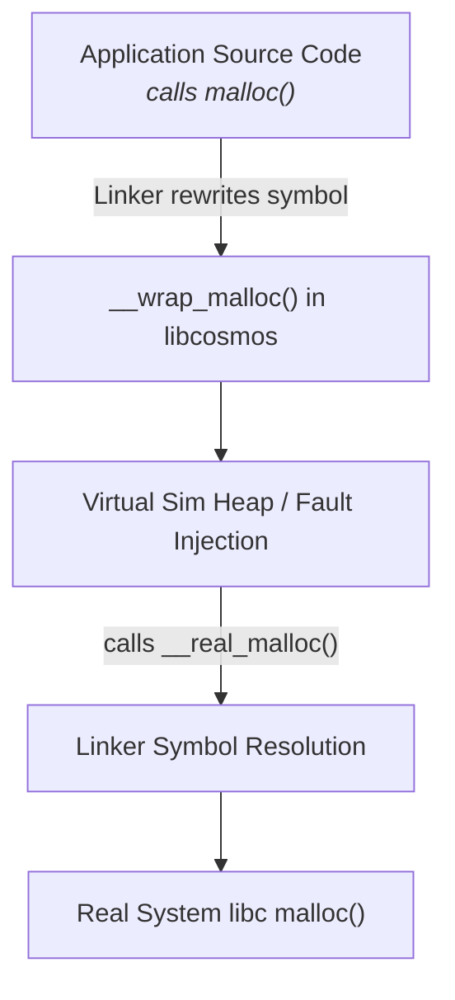

# Linker Symbol Interposition (`-Wl,--wrap`) in Cosmos

This document explains how function address resolution is routed through the DST middle layer via linker symbol interposition (`-Wl,--wrap`), the `__real_*` passthrough mechanism, and toolchain mechanics.

---

## 1. Overview & Core Concept

Cosmos executes unmodified C/POSIX applications deterministically by intercepting standard POSIX library symbols (`malloc`, `clock_gettime`, `pthread_create`) at final link time, avoiding custom source-level runtime abstractions.



---

## 2. Linker Symbol Resolution Mechanics (`-Wl,--wrap`)

The `-Wl,--wrap=<symbol>` linker option provided by GNU `ld` and LLVM `lld` performs symbol table transformations at final executable link time:

1. **`symbol` ➔ `__wrap_symbol`**: Undefined references to `symbol` across all input object files and linked static libraries are rewritten to resolve to `__wrap_symbol`.
2. **`__real_symbol` ➔ `symbol`**: Undefined references to `__real_symbol` are rewritten to resolve directly to the original, unwrapped `symbol` definition (e.g., from `libc` or `libpthread`).

### Synthetic Symbol Resolution (`__real_*`)
`__real_symbol` routines are synthetic symbols created by the linker; they are never defined in source code or headers. Wrapper files specify an `extern "C"` forward declaration (e.g., `extern "C" void* __real_malloc(size_t);`) strictly to satisfy frontend compiler type checking. At link time, the linker resolves references to `__real_symbol` by aliasing them directly to the underlying system library symbol.

---

## 3. Codebase Implementation & Example

### A. Wrapper Source File
In [`src/cosmos/wrappers/wrap_memory.cpp`](file:///home/vaibhav/work/cosmos/src/cosmos/wrappers/wrap_memory.cpp):

```cpp
#include <cstddef>

extern "C" {

// Forward declaration of the linker-synthesized real symbol alias:
void* __real_malloc(size_t size);

// Interposition wrapper called whenever application code calls malloc():
void* __wrap_malloc(size_t size) {
    // 1. Intercept call (apply virtual heap tracking, OOM fault injection, etc.)
    // 2. Delegate to the real system allocator via __real_malloc:
    return __real_malloc(size);
}

} // extern "C"
```

### B. CMake Build Configuration
In [`examples/single_node/CMakeLists.txt`](file:///home/vaibhav/work/cosmos/examples/single_node/CMakeLists.txt):

```cmake
add_executable(kv_store_sim kv_store.c)
target_link_libraries(kv_store_sim PRIVATE cosmos)

if (CMAKE_C_COMPILER_ID MATCHES "GNU|Clang")
    target_link_options(kv_store_sim PRIVATE
        "-Wl,--gc-sections"
        "-Wl,--wrap=malloc"
        "-Wl,--wrap=free"
        "-Wl,--wrap=pthread_create"
        "-Wl,--wrap=clock_gettime"
        "-Wl,--wrap=open"
        "-Wl,--wrap=read"
        "-Wl,--wrap=write"
        "-Wl,--wrap=fsync"
        "-Wl,--wrap=getrandom"
    )
endif()
```

---

## 4. Official Toolchain Citations

### 1. GNU Linker (`ld` / Binutils)
* **Documentation**: [GNU `ld` Manual — Command-Line Options](https://sourceware.org/binutils/docs/ld/Options.html)
* **Option**: `--wrap=symbol`
* **Official Specification**:
  > *"Use a wrapper function for `symbol`. Any undefined reference to `symbol` will be resolved to `__wrap_symbol`. Any undefined reference to `__real_symbol` will be resolved to `symbol`.*
  > 
  > *This can be used to provide a wrapper which checks the arguments, or provides default values, or logs the call. The wrapper function should be called `__wrap_symbol`. If it wishes to call the real function, it should call `__real_symbol`."*

### 2. LLVM Linker (`lld` / Clang)
* **Documentation**: [LLVM `lld` Command Line Reference](https://lld.llvm.org/) / `man lld`
* **Behavior**: LLVM `lld` implements full drop-in specification parity for `--wrap=<symbol>`. References to `symbol` are rewritten to `__wrap_symbol`, and references to `__real_symbol` resolve to the unwrapped symbol `symbol`.

### 3. GCC & Clang Compiler Frontends (`-Wl,`)
* **Documentation**: [GCC Manual — Options Controlling Linking](https://gcc.gnu.org/onlinedocs/gcc/Link-Options.html)
* **Option**: `-Wl,option`
* **Official Specification**:
  > *"-Wl,option : Pass option as an option to the linker. If option contains commas, it is split into multiple options at the commas."*

---

## 5. Technical Considerations & Best Practices

1. **Link-Time Garbage Collection (`-ffunction-sections` + `-Wl,--gc-sections`)**:
   In Cosmos ([`src/cosmos/CMakeLists.txt`](file:///home/vaibhav/work/cosmos/src/cosmos/CMakeLists.txt)), each `__wrap_*` symbol is built with `-ffunction-sections`. This ensures that if a target binary wraps a subset of symbols (e.g. `malloc` but not `calloc`), `-Wl,--gc-sections` discards unused `__wrap_*` functions and prevents undefined references to un-wrapped `__real_*` symbols.
2. **Same Translation Unit Direct Calls**:
   If a function call and definition exist in the same translation unit, compilers may optimize calls directly without generating an undefined symbol reference in the object file relocations. Interposition via `--wrap` applies strictly to calls resolved across translation units / object boundaries.
